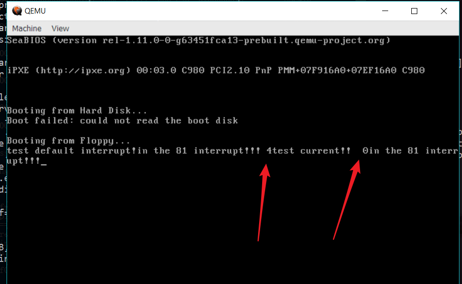

[TOC]


#  实验目的

1. 使用时钟中断实现进程切换

## 本次实验说明

在期中的时候，我打算进入保护模式，但是那时候刚好逢实验六的DDL快到了，想到我前一个实验已经做完了进程切换，实验六再做也就没意思了，于是就打算进入保护模式试一下，没想到一试就试了这么久。拖了这么久的DDL，实在是抱歉！！

在实现本次实验的过程中，由于

# 操作系统整体设计

~~~flow
```flow
st=>start: Start
op=>operation: Your Operation
cond=>condition: Yes or No?
e=>end

st->op->cond
cond(no)->op
cond(yes)->e
```
~~~


## 文件组织


## 启动流程

###  引导启动 

在引导启动阶段，运行的代码主要在boot.asm

### 初始化保护模式

`head.asm`

### 初始化操作系统


# 操作系统模块说明

## 模块组织概述

## 中断系统的设计

###  编写工具函数

在`include/protect.h`中写好了对全局中断向量表进行操作的工具函数，于是在内核就可以通过简单的调用`set_XXX_gate`来对中断向量表进行设置。

### 通用中断处理例程的设计

我们先使用以下的方式对中断处理例程进行初始化，这样初始化后，就可以使用一个通用的函数对中断进行处理与分流。注意x86自带的陷阱后面会被覆盖。

```cpp
interrupt_0:
	push 0
    jmp <common_intr_handler>
    nop
interrupt_1:
	push 1
    jmp <common_intr_handler>
    nop
....
```

当中断发生后，会将中断push进内核栈中，并且跳到`common_intr_handler`中进行处理。

该函数会判断该中断的类型，并调用对应的处理例程。

```cpp
interrupt_handler(uint8_t n){
    // 索引到irq_desc的第n项，这里的n 如何对应上？
    // 调用该项对应的action
}
```

以下分两类中断进行设置

#### 陷阱门 `traps_32.h/c`

在内核启动函数中，使用`init_trap()`函数来初始化保护模式内的32种异常（或者说陷阱）

这里的函数都在文件`traps_32.c`内实现

该`init_trap()`函数内大概如此实现，**会将前面已经初始化过的一些表项覆盖掉**。

```cpp
void init_trap(){
    set_trap_gate(0,&trap_function_pointer);
    set_trap_gate(1,&trap_function_pointer);
    ....
    set_trap_gate(31,&trap_function_pointer)
}
```

具体的异常处理函数，也都放在该文件中。

#### irq线对应的中断处理例程 `interrupt.h/c`

x86一共有256个中断，除了32个intel保留的内部中断，剩下的224个中断由irq_desc数据负责处理与实现。

```cpp
struct irq_desc{
    /* 中断处理例程 */
    struct irqaction *action;
}
```

## 进程

1. 确定进程控制块的结构
2. 编写restart函数，启动一个init进程，该进程工作在ring3
3. 编写时钟中断
4. 编写一个系统调用，需要有一个完整的流程


当时钟中断发生的时候，push一个数，然后save 寄存器到 进程控制块，

```cpp
恢复的时候，从新进程的内核栈中获得上下文，然后返回。
```

1. 进程控制块，头为栈信息


## 遇到的问题记录

C语言中，传参的指针会失去大小信息

```cpp
void update_current_process_context(PT_REGS * regs){
    ...
    memcpyk((char *)regs, (char *)&current->regs, sizeof(regs));
    ...
}
```

我有一个函数一开始是这么写的，但是一直没有成功，后来打印了`sizeof(regs)`发现结果是4



终于才明白过来，不能够这么写，必须使用类型名。

```cpp
void update_current_process_context(PT_REGS * regs){
    ...
    memcpyk((char *)regs, (char *)&current->regs, sizeof(PT_REGS));
    ...
}
```


## 系统调用的设计

参考资料：
linux系统调用列表
https://linux.die.net/man/2/syscalls
https://www.ibm.com/developerworks/cn/linux/kernel/syscall/part1/appendix.html
https://www.ibm.com/developerworks/cn/linux/l-system-calls/
http://fpc-mips.sourceforge.net/LinuxSyscall_cn.html
https://linux.die.net/man/2/intro