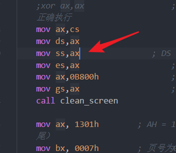
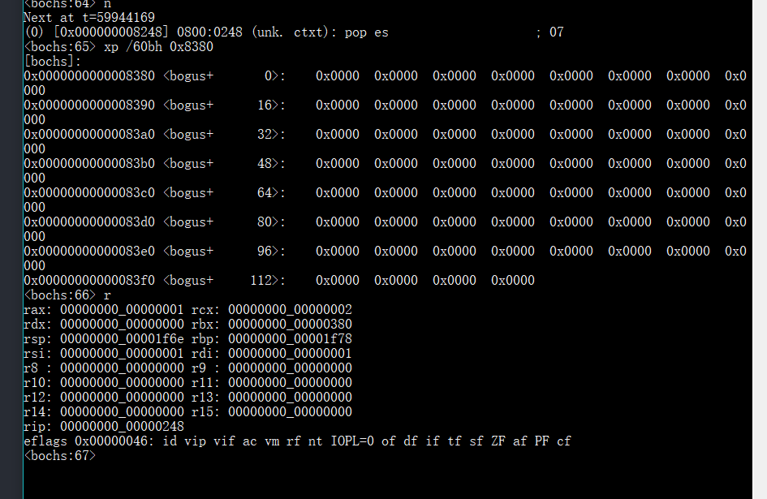
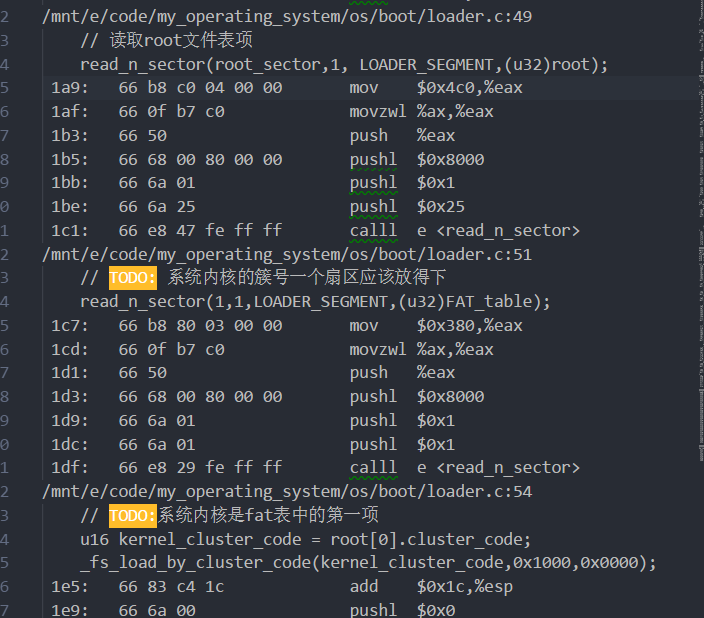
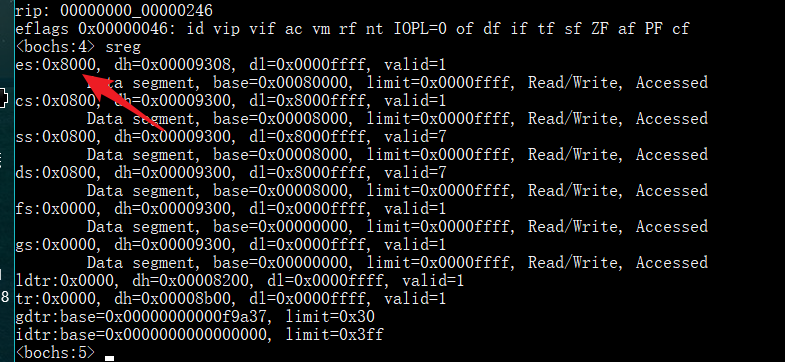
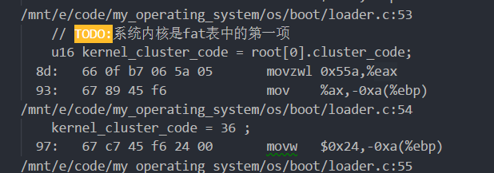
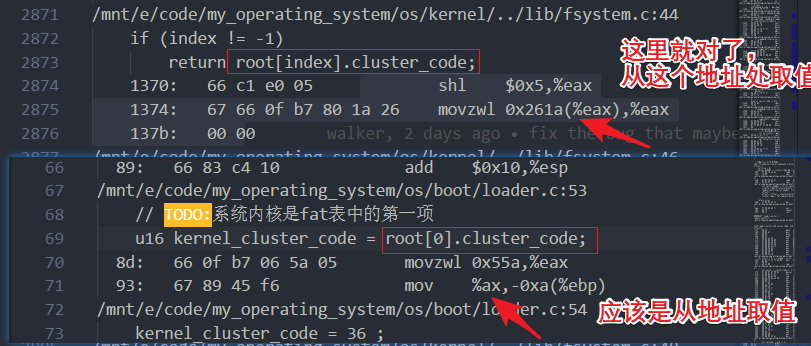
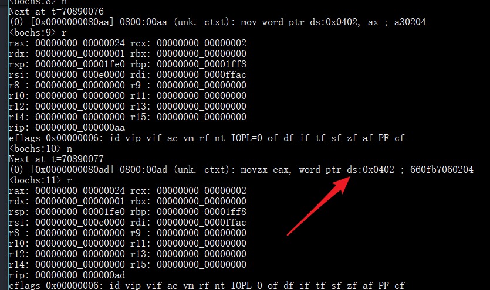

# week6打码日志

我的心很小，一次只能容纳一个项目，事实上这周，心里只有计网项目，几乎没有动过操作系统，可能要gg了。

## 实现需求：

1. 实现一些中断，将这些中断包装成函数，这些包含中断的函数可以被用户直接调用，用作从用户态转入内核态干活的方法。
1. 使用C程序写一个用户程序，调用这一些类似于系统调用的函数
1. 将这个新的用户程序放到软盘的不同位置处
1. 将以前写的几个跳动的A的程序放到用户程序处
1. 加载程序部分，能够加载多个用户程序进内存中（维护一个地址和对应的标签，标签表示该地址有没有被用过）
    1. 每次加载一个程序，就从这个数据中取一个没有用过的地址，加载进去然后运行
1. 实现进程控制块，两个用户程序交替运行
1. 实现一个命令，这个命令会触发进程交换
    1. 先将两个进程对应的信息写进进程控制块表
    1. 将时钟中断改成进程切换
    1. 再写一个启动函数，加载进程控制块其中一块


## 修一个bug

原来的时钟中断没有保存时钟中断没有用的寄存器，会导致一种情况：在终端输入的时候，可能会随机出现卡死的情况。
这种情况的来源，是因为时钟中断会随时发生，如果发生在下面的两条语句中间，还修改了ax，可能会崩掉：
```
mov ax, cs
mov ds, ax
```

在int 16h中断中，有这样的语句：
```
push ds
mov ds, 0x40
;恢复ds的值
```
一旦时钟中断在ds改变后发生,时钟中断还依赖于数据段寄存器的正确取值，就会可能出现问题，这个问题来源于时钟中断的独立性没有保证。
时钟中断作为一个可能随时都会发生的一个过程，必须保证绝对不会修改任何寄存器，同时也要尽可能的减少对寄存器的依赖。在我的实现中，时钟中断后来修改成只依赖cs在内核态的正确取值。这也是我第一次接触到pusha和popa这一类指令，极大地方便了我保存状态。

在将我的int8中断头尾加上如下内容之后，经过暴力测试，没有出现卡死的情况。

```
    push es
    push ds
    push ss
    pusha

    ;时钟中断具体内容

    popa
    pop ss
    pop ds
    pop es
```

## 整理用户程序，多个弹跳的用户程序需要放回到软盘中

将以前的四个用户程序移动到user文件夹下，并为了新内核的实现做了一点点修改（这个修改主要是增加了org 0x4000， 还有删掉了vstart语句）

然后将四个用户程序放到软盘里面,并修改相应的脚本文件。

增加完四个用户程序，也成功加载了，但是运行似乎出了问题？卡死了，并且回不去？


先考虑检查用户程序的段对不对?
先对照了一下能跑的用户程序与会宕机的用户程序，发现了一个区别


的确，如果将栈改了，的确会使程序的返回出现问题，但是现在的问题不在这里，在于运行的时候就出了问题。不过考虑到显示了笑脸，因此程序的加载地址是没问题的。

问题来了，即使我直接将用户程序1的代码复制过来也跑不了？排除用户程序的问题，开始寻找加载的问题。
排除了多次加载会出现问题（测试run stone1 与run u_e1)

通过bochs，发现加载stone2的时候，内存对应内容是0？后来发现，自己的程序被加载到了0x14800中，开始思考，是加载的时候扇区没有对上吗？错位了4个扇区？


定位到自己的makefile，发现我算错数了，126+18=144才对。


### 又出现问题，stone3用户程序退出会崩溃

历史遗留问题，我自己实现的int40h要补充参数，以前的没有移参数到ax中

## ouch！的实现

编写一个用户程序，用于实现ouch！

原理是轮询键盘缓冲区，一旦有按键就在随机位置输出ouch。

现在想用C程序写用户程序了，总觉得会遇到问题。
内核如何跳到我的ouch用户程序？
直接函数调用，不会改段，于是通过修改ip，我直接跳到ouch程序，这就与我用户程序的加载位置有关。如果我的加载位置放到内核段内，可以，和我其他的用户程序没什么区别，只要和内核链接到一起就行了。

但如果我想让我的ouch程序独立开来，就必须切换栈段，还需要换段，让我的用户程序独立编译。我的用户程序使用的是同一段，gcc默认我四个段寄存器都是相同的。要让我的内核跳转到用户程序，就需要写一个restart()函数，从进程控制块中读取对应的信息，然后保证环境配置完毕后，将栈切换到用户栈，将对应的信息放到用户栈中，通过一个iret去到用户程序内运行。

用户程序如何退出呢？退出有两种：保存现场的退出和不保存现场的退出。

对于不保存现场的退出，我应该是直接jmp 到内核的初始化部分就好，我要写一个中断，这个中断能够实现修改栈段为内核的当前栈段，然后读取cs,ip然后回来。
其实也就是说，我要为内核专门实现一个进程控制块，这个块的地址可以直接访问，然后还需要实现一个中断，这个中断，不会管用户程序怎样，只会从内核进程控制块中读取信息，然后跳到进程控制块对应的位置。

对于保存现场的退出，我应该是在时钟中断中实现。这个时钟中断我可以根据全局变量（当前进程号），将这个进程的信息存到指定的结构体中，然后在内核中实现调度，然后加载指定控制块的信息到环境中，然后iret进行切换。


### 先将ouch放到内核中

其实实现还是很简单的，不过出现了一些问题
1. gcc生成的用户文件似乎有点大
1. 加载fat表的函数参数设置得不好，太小了，可能没有将对应的表项加载进来。

现在我的操作系统有一个比较严重的问题：各个部分的内存分配有点乱，可能会相互覆盖，没有控制好。放一个TODO:

还有一个问题诶，如果我要使用C库，由于C库的依赖关系，我必须整个库都给链接进去，这就很难看。

## 考虑整理我的C库函数

将我的库函数，整理成一个C的库函数。
内核需要做的事情，就是各种系统中断。

然后我的程序，只需要链接这一个静态库进行编译，就可以在我的操作系统上运行。

## 我要做的事情：

1. 在开机时，使用一个程序加载我的内核
1. 初始化我的进程控制块,并写一个restart函数，用来加载当前进程控制块所在的程序
1. 在内核中写好各种系统调用

### 开机加载内核


1. 有一个小程序用于从fat表寻找kernel.bin，并加载到内存0x1000:0x0000中
    1. 编写加载器
2. 跳转过去

出现了一些bug
问题源于连接器把_start函数放到了中间，并没有放到最前面，于是运行过程出现了问题。

第二个问题:将fat表读取到内存的时候，似乎完全读不到。



是因为我没有传地址吗？



惊！似乎es的值错了


好吧，其实就是我段地址赋初值错了，以前也试过这样忘记移动四位。

但是好像还是不行。


问题在于：
```
u16 kernel_cluster_code = root[0].cluster_code;
```
对应的汇编没有看懂，但是可以肯定的是这一句话出了问题。


## 记录一个内存改写的bug

我的fat文件表还有root根目录表似乎不对。
0x8560是我的根目录区的内容，但是直到0x8620，才有完整的内容。


问题是这样子的

```c
    // 读取root文件表项
    read_n_sector(root_sector,1, LOADER_SEGMENT,(u32)&root);
    // TODO: 系统内核的簇号一个扇区应该放得下
    read_n_sector(1,1,LOADER_SEGMENT,(u32)&FAT_table);
```
后面读取fat表时，一定会改写一个扇区大小的内容，而fat_table的地址是0x8420，因此一读，就改到了0x8620。

## 记录一个奇怪的问题



```c
u16 kernel_cluster_code = root[0].cluster_code;
```

从图片中可以看出，这里虽然拿了地址，但是并没有从该地址处取值，而是直接将这个地址给了这个局部变量。
但是在另一个示例中，却能够正确取值。
受到启发，我这样子试了一下。

诶，结果还真行



ax成功取到了0x24

其实刚刚我搞错了，的确是有取值的。

问题在于前面各种内存改写，导致我全局变量的值都不对。

## todo

加载器完成，系统内核可以不用担心大小了。

然后我应该去做内核。

我对系统内核的理解：系统内核就是为程序提供了各种服务的一个工具包。
这个服务，包括显示输出，包括读取文件，包括进程切换等等。
但是为了安全起见，我不能够直接管理这一个工具包里面的东西（像文件内容，内存信息）
这时候就需要一个硬件层面的东西，来对使用工具的方式进行控制，在这里就是中断。

我的问题在于：如何向系统调用传递参数：

直接传递地址？

就想想读写内存还有读写端口如何包装成系统调用吧：
包装成系统调用的好处，就是我可以在C中编写能够切换到内核态并运行内核指令的代码。


### 将读写端口改写成以中断调用的方式调用。

问题：通过看汇编代码的方式，发现在调用write_port_byte()的函数中，生成了依赖寄存器的代码，但是我write_port_byte()函数却会修改一些寄存器。导致出现问题。

解决：在写汇编过程的时候，分两种情况

1. 编写函数，遵循规范，ax为调用者保存，其他都是被调用者保存
1. 编写中断，需要保存完整现场。

ok

## todo

1. 进程控制块
1. 初始化进程控制块，
1. 先写一个很简单的用户程序，使用远跳转跳过去（跨段），不返回，看看怎样
1. 编写进程控制块，restart函数，使用restart函数跳过去
1. 编写另一个用户程序，同样使用restart函数跳过去来测试
1. 编写时钟中断，根据进程控制块，两个程序轮流运行。

### 先制作C运行环境静态链接库

制作完成

容易遇到的坑：

链接产生的用户程序特别大


### restart函数的编写

问题主要在如何切换栈
因为有一个pop ss的操作。

用户程序要去到另一个段中。

一开始想了很久怎么实现，思考切换栈想了很久。
后来想了半天，干脆决定先将信息复制到用户栈中，然后转到用户栈中进行pop，读取信息的操作。
搞定！

### 时钟中断的编写

我需要实现一个时钟中断，用于进程切换！

思路其实很明确了
当用户程序被时钟中断触发时，需要先将信息存到进程表中。
方法是先将所有信息存到用户栈中，然后复制到进程表中。
ok！

加载新进程的方法就和restart一样了。

多进程就搞定啦！