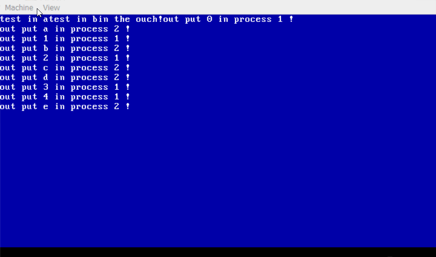
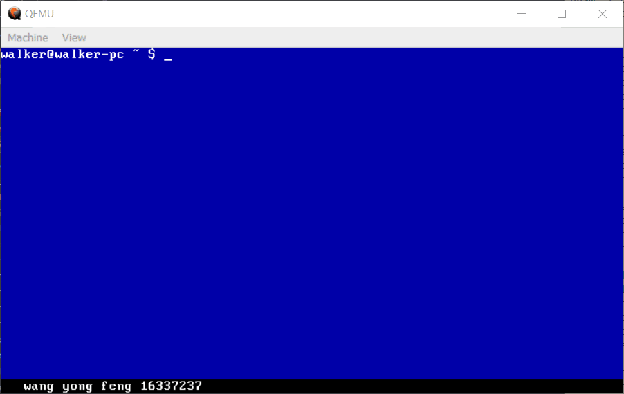

# 操作系统

就把自己在开发操作系统中遇到的各种问题都放上来吧。
放一个开发日志啥的，以方便大家参考。
有一些资料可以供大家参考的也都会放上来。

大概的目标吧，还是想写一个足够完整的操作系统。
至于这个“足够完整”该如何定义，现在也不清楚，尽力吧。

## 录屏效果展示

### 进程切换录屏效果展示

### tty

## 实现功能

- [x] 引导扇区加载内核
    - [x] 引导扇区加载加载器
    - [x] 加载器通过文件系统的接口加载内核
- [ ] FAT16文件系统的实现
    - [x] FAT表以及根目录区
    - [x] 根据文件名读取指定文件到指定内存地址处
    - [ ] 目录
    - [ ] 写文件
- [] 进程模型
    - [x] 进程控制块
    - [x] 修改int 8h 实现多进程的时间片轮转运行
    - [ ] 为进程增加状态，实现二/五/七状态进程模型
- [ ] 系统调用
    - [x] 系统调用表的实现
    - [x] 安装系统调用
    - [x] 实现一个简单的测试系统调用
    - [ ] 为操作系统提供的服务包装成系统调用的形式
    - [ ] 为系统调用提供一个通用的保存现场和恢复现场的宏
- [x] 用户C运行时库
    - [x] 用户C运行时库静态链接成.a文件
    - [x] printf系列函数的简单实现
    - [x] 用户运行时C库与内核的解耦
- [x] 简单的命令行终端(与内核绑定)
    - [x] ls 命令
    - [x] run 命令 运行指定程序

## TODO

### 操作系统结构上的TODO
1. 将操作系统提供的服务，进一步包装成系统调用的形式，从而让用户C运行时库能够为用户提供更多的与内核交互的功能，而不需用户程序直接访问内核的数据。
1. 编写功能更加丰富的用户C运行时库
1. tty与操作系统解耦，可能要重写tty

### 功能性的TODO:

1. 内存分配
1. 编写系统调用
    1. 创建进程
    1. 终结进程

## 开发环境

环境：ubuntu for window （win10子系统）

工具链
1. gcc,ld ：c语言必备开发工具
1. make : makefile 解释器
1. nasm：汇编器，能够汇编16位/32位的汇编代码（听说64位也行）
1. dd：将二进制文件写入镜像文件中
1. bximage:(bochs内自带)用于生成二进制文件
1. bochs：虚拟机，调试必备，打开较慢
1. qemu：虚拟机，快速运行查看结果

## 如何运行

1. 先确保在开发环境中的各项工具都可在命令行下直接运行（即在系统环境变量中）
1. 在os文件夹下运行make all，就可以自动编译打开虚拟机。

## 文件组织

1. docs
    1. 放一下在开发过程中遇到的问题，以及需要的各种文档的链接，方便自己也方便大家针对某问题寻找对应的解决方案。
1. dependence
    1. 放一下bochs依赖的几个文件
1. os
    1. 操作系统源代码
1. report
    1. 实验课的实验报告，使用xelatex编译（texlive 2017）。

